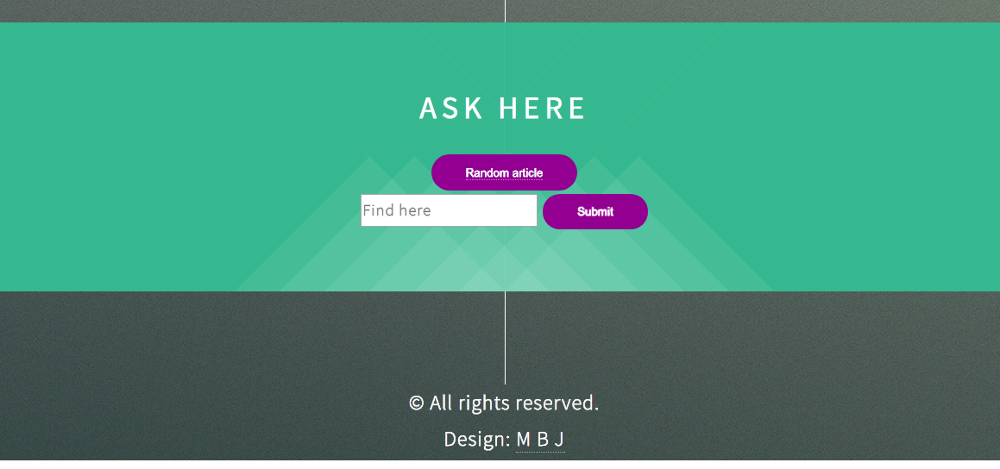

# Wikipedia-Viewer
In this mini-project I have developed a  web application that displays a result of searching from wikipedia , as part of my full stack JavaScript training offered by [GOMYCODE Tunisia](https://www.gomycode.tn) and this is a link to the app:https://moezbj.github.io/wiki-app/.
## Project brief
This is a small web application wich does the following:

<strong>User Story</strong> I can search Wikipedia entries in a search box and see the resulting Wikipedia entries.

<strong>User Story</strong>  I can click a button to see a random Wikipedia entry..

The following screenshot shows my App:

    
    

## What I have learned

* How to use wikipedia API

* Use jquery to mnipulate the response of Ajax call

* deal with a bootstrap template 